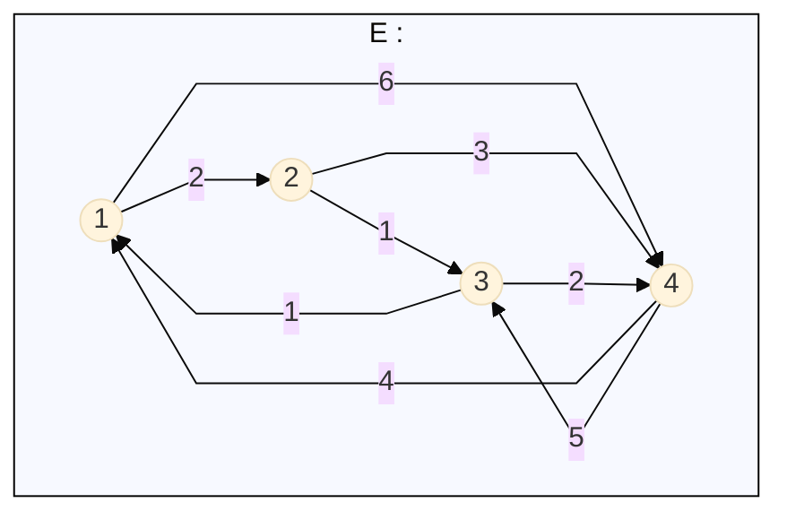

_Weber Loïc_

# 1. Généralité sur les Graphes

## 1.1 Graphe Simple
Trouver exemple graphe simpleeeee

## 1.2 Graphe Orienté
Pareil

## 1.3 Connexivité
Explication + exemple graphe 3 connexe.

## 1.4 Graphe Particulier

### 1.4.1 Graphe Complet
Exemple et infos

### 1.4.2 Graphe Discret
Exemple et infos

### 1.4.3 Arbres
Définition et exemple.

## 1.5 Arbres Couvrant.
Definition et objectif

### 1.5.1 Trouver nombre d'arbres couvrant

#### 1.5.1.1 Codage

#### 1.5.1.2 Décodage

### 1.5.2 Kruskal
Definition / Explication
Exemple avec un tableau et un graphe exemple.

### 1.5.3 Prim
L'Algorithme de Prim permet aussi de trouver l'arbre couvrant minimal.  

Principe : On part d'un sommet et on va faire croitre un arbre en choisissant une arête minimal qui n'est pas reliée à un sommet déjà dans l'arbre.

On a besoin de garder en mémoire : 
- Les prédécesseur des sommets.
- Les coûts / poids des arêtes.

Prenons le graphe E suivant :

Le tableau distance :
| Etats | 1 | 2 | 3 | 4 |
|:-----:|:-:|:-:|:-:|:-:|
| init|0*|$+∞$|$+∞$|$+∞$|
| $n=1, x=1$|\||2*|$+∞$|6|
| $n=2, x=2$|\||\||1*|3|
|$n=3,x=3$|\||\||\||2*|

Le tableau prédécesseur :
| Etats     | 1 | 2 | 3 | 4 |
|:-----:|:-:|:-:|:-:|:-:|
| $n=1, x=1$| |1| |1|
| $n=2, x=2$| |1|2|2|
|$n=3,x=3$  | |1|2|3|
